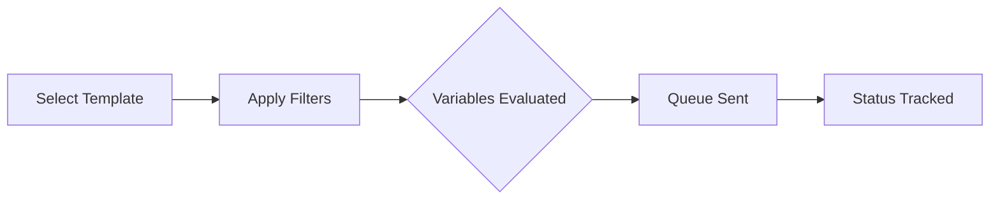

## What this feature does

**Batch Sender** helps you send identical or personalized campaign logic to multiple WhatsApp contacts in a controlled, automated way. It eliminates the need to manually copy-paste the same message over and over again.

**It is best used for:**
- 📣 **First outreach**: Introducing your product to cold leads
- 🔔 **Follow-up reminders**: Nudging pending deals
- ♻️ **Reactivation campaigns**: Waking up dormant customers
- 🎯 **Segmented messaging**: Sending targeted offers to VIPs

---

## 🎯 How targeting works

Batch Sender allows precision targeting so you never spam the wrong audience. You can target contacts by:

- **Explicit selection**: Hand-picking individual contacts
- **Country Code**: Filtering by geographic location
- **Customer Type**: Targeting tags like "Lead", "VIP", or "Closed"
- **Lead Filters**: Using dynamic segments from the Lead Manager

> [!NOTE] **Data Privacy**
> This keeps your segmentation deeply tied to the data already stored and analyzed within the product, without needing to export to heavy CRM systems.

---

## 🔗 Why Templates Matter Here

Batch sending is much more reliable and professional when the message body is driven by a **Message Template** instead of a one-off draft typed on the fly.

Using templates in Batch Sender drastically reduces:
- ❌ Inconsistency in sales pitches
- ❌ Accidental wording or typo errors
- ❌ Operator overhead

---

## 💡 Best Practice

Do **not** batch-send to your entire contact list at once. Narrow the audience first, especially when:

1. The message depends on **customer type** (e.g., Don't send a "Welcome" pitch to an active client)
2. The message assumes a **specific buying stage**
3. The message references a **previous quote** or follow-up

> [!IMPORTANT] **WhatsApp Anti-Spam**
> Always respect WhatsApp's platform rules. Sending overly generic messages to thousands of contacts at once may increase block rates. High segmentation is the key to high conversion.
