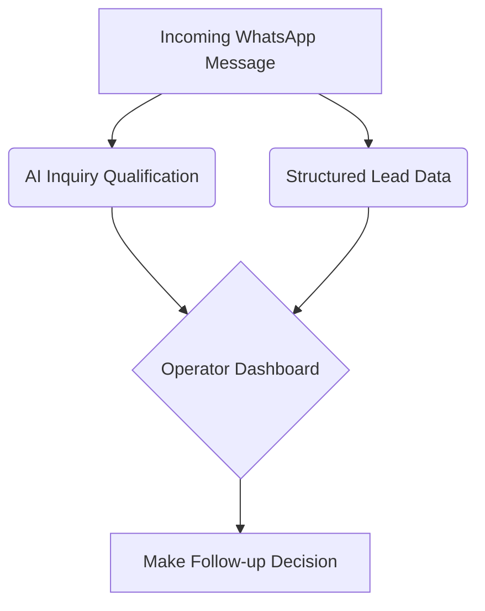

## 🧠 The two parts of Lead Intelligence

Agent for WhatsApp intentionally separates lead understanding into two distinct layers to keep the UI clean and actionable:

### 1️⃣ AI Inquiry Qualification

This layer actively processes incoming messages and answers:
- Is this contact worth following up right now?
- How strong is the **buying signal**?
- What is the most likely **next step**?

### 2️⃣ Structured Lead Information

This layer stores factual CRM-like data and answers:
- Who the customer likely is (Name, Role, Company)
- Where they are from (Country, Region)
- What kind of customer they might be (Lead, VIP, Partner)
- What their recent intent looks like

---

## ✈️ Why this is intentionally lightweight

The product is **not** trying to become a heavy, bloated CRM. For most small teams and solo operators, the real priorities are simple:

1. **Know who matters**
2. **Know what to say next**
3. **Avoid missing important follow-ups**

That is why the UI is heavily optimized around **action**, not endless manual data entry.

> [!TIP] **Action Over Data**
> Let the AI extract the data while you focus on closing the deal.

---

## 💡 Best Practice

Treat the AI's analysis as a **starting point**, not absolute permanent truth.

The most effective daily workflow is:

1. 🤖 **AI generates** a first pass of the lead profile
2. 👨‍💻 **User edits** or refines the fields if needed
3. 🔒 **User locks** the result when it becomes operational truth

> [!IMPORTANT] **Data Locking**
> Once you lock a field, the AI will stop attempting to overwrite it during subsequent conversations, ensuring your manual corrections are preserved.
