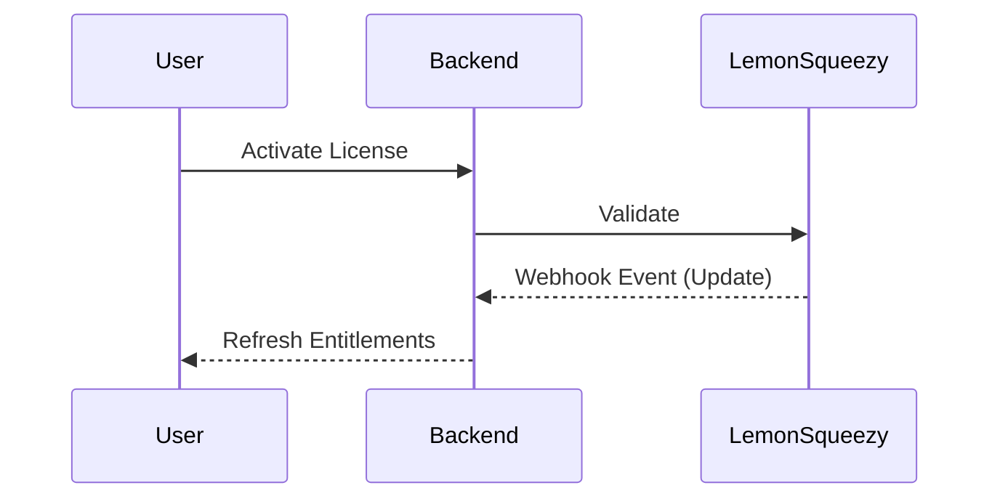

## 👥 What this guide is for

This guide is intended for **internal operators and admins** who need to understand how license state flows from our billing provider (Lemon Squeezy) into our backend, and how that ultimately affects paid feature access within the extension.

---

## 🔄 Main Integration Flow

The entire lifecycle of a license follows this sequence:

1. A user successfully activates or binds a license key in the UI.
2. The backend stores normalized license fields locally.
3. Lemon Squeezy sends real-time `subscription` and `license key` webhook events.
4. The backend updates local subscription and license states dynamically.
5. Config endpoints convert those states into rigid feature gating constraints sent to the extension.

---

## 🪝 Important Webhook Route

The core production webhook endpoint should point exactly to:

`/api/v1/webhooks/lemonsqueezy`

> [!WARNING] **Method Delivery**
> If the URL points at the wrong host or root path, Lemon Squeezy may show successful delivery failures such as `405 Method Not Allowed`.

---

## 🔒 How Feature Locking Works

Paid features are strictly controlled by the intersection of both:
- **License Validity**: Is the key structurally authentic and not revoked?
- **Subscription Status**: Is the billing cycle currently `active` or `past_due`?

That means an active, mathematically valid key alone is **not enough** if the subscription payment state has become blocked or cancelled in the backend.

---

## 🛠 Recovery and Repair

If a user's local license snapshot becomes inconsistent with their actual payment, operators should:

1. Confirm **webhook delivery logs** in Lemon Squeezy.
2. Confirm the latest `subscriptions` and `licenses` rows in the database.
3. Use repair tooling or explicitly replay the webhook event only when needed.

This internal operational layer drastically reduces support pressure. When operators deeply understand this state model, they can immediately distinguish between a setup problem, a webhook sync problem, or a genuine paid entitlement issue.
