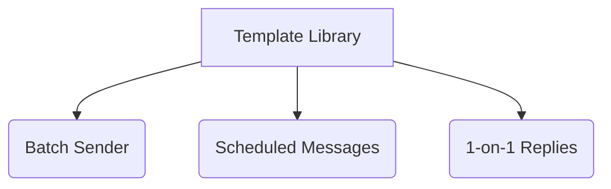

## What this feature does

**Message Templates** are reusable reply blocks designed for common sales and support scenarios. They drastically reduce repetitive writing and make your messaging approach consistently professional across all workflows.

---

## 🔁 Where templates can be used

Templates are a central piece of your workspace and are currently shared across multiple core modules:

- 📝 **The Message Template Manager** (Create and edit)
- 🚀 **Batch Sender** (Broadcast to multiple contacts)
- ⏱️ **Scheduled Messages** (Delayed follow-ups)

That means you only need to create and maintain your templates **once**.

---

## 🎯 Typical template use cases

Here are some of the most effective ways our users leverage templates:

- **First-touch outreach**: Standardizing the opening pitch
- **Quote follow-up**: Checking in after sending pricing
- **Sample confirmation**: Confirming address and shipping
- **Payment reminder**: Polite prompts for unpaid invoices
- **Reactivation**: Re-engaging silent or dead leads
- **After-sales**: Automated follow-up post delivery

> [!TIP] **Preset script library**
> Don't want to write from scratch? The product includes a **preset script library**. You can immediately copy a proven script, save it as a personal template, and adapt it to your own sales tone.

---

## 🧬 Dynamic Variables

For deep personalization at scale, template content supports dynamic variables:

- `{{name}}`: Injects the contact's saved name
- `{{number}}`: Injects their WhatsApp phone number

These variables are **automatically resolved** at send time, provided the workflow has enough customer context available.

---

## 💡 Best Practice

Keep templates **short** and **scenario-specific**. A strong template usually does only _one_ thing:

1. Reopen a conversation
2. Request missing information
3. Push a specific next step

> [!WARNING] **Common Mistake**
> A template should **not** try to close every objection in one giant message. Long walls of text perform poorly on WhatsApp. Keep it conversational!
