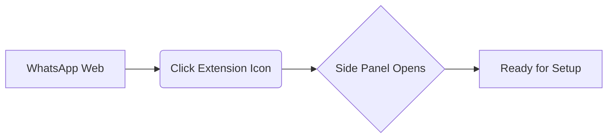

## What this guide covers

This guide helps a new user reach first value with Agent for WhatsApp in one setup pass:

1. **Install** the extension
2. **Sign in** with Google
3. **Bind** a valid license
4. **Connect** an AI provider
5. **Send** the first reply or workflow message

---

## 🚀 Before you start

Make sure you have:

- **Preferred Browser**: Chrome, Opera, or Firefox
- **Account**: A Google account you want to use inside the extension
- **License Key**: A valid Agent for WhatsApp license (if you are using paid features)
- **API Key**: At least one AI connector key such as `OpenAI`, `OpenRouter`, or `Groq`

---

## 🛠 Step-by-step Setup

### Step 1: Install the extension

Install Agent for WhatsApp from the browser store, then pin the extension so it is easy to access while you are inside WhatsApp Web.

> [!TIP] **Pro Tip**
> Pin the extension to your browser toolbar to ensure one-click access to your workflows.

### Step 2: Open WhatsApp Web and launch the side panel

Go to WhatsApp Web and open the Agent for WhatsApp side panel. The product is designed to work inside your existing WhatsApp workflow, so most setup happens there.

### Step 3: Sign in with Google

Use Google sign-in to create or reconnect your account. This is the identity layer for your settings, license binding, and future sync.

> [!NOTE] 
> If you already purchased a license with a different email, that is still okay. You can bind the license after login as long as the license itself matches the purchase record.

### Step 4: Bind your license

After Google login, open **Account Settings** and bind your license key.

**What happens after a successful bind:**
- 🟢 The license is attached to your account
- 🟢 Your feature set is upgraded based on the active plan
- 🟢 Future entitlement checks are tied to both license and subscription state

> [!WARNING] **Troubleshooting**
> If binding fails, go to the troubleshooting section first instead of retrying blindly.

### Step 5: Connect an AI provider

Open **Connector Settings** and add the provider you want to use.

**Common options:**
- `OpenAI`
- `OpenRouter`
- `Groq`
- `Local connector` (if you are using self-hosted inference)

The connector determines how the product handles AI features such as message analysis, lead qualification, and assisted replies.

---

## ✅ Validation

Choose one of these paths to validate setup:

1. Create a `message template`
2. Schedule a message to yourself
3. Run `batch sender` on a small list
4. Refresh `AI inquiry qualification` for one contact

### What good setup looks like

After setup, you should be able to:

- [x] See your account as logged in
- [x] Confirm your plan in account or license config
- [x] Save and reuse message templates
- [x] Run AI-powered lead analysis without connector errors

> [!IMPORTANT] **Best Practice**
> Do not try every feature at once. Start with connecting your provider, creating one template, and testing it. This path gives the fastest confidence that the product is working correctly.
