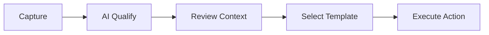

## 🎯 Best-fit Users

Agent for WhatsApp operates as a highly specialized, lightweight sales copilot. It thrives where traditional CRMs collapse under data-entry overhead.

**This product is especially strong for:**
- 🚢 **Exporters & Agencies**: Teams executing heavy WhatsApp-based sales
- 👨‍💻 **Solo Founders**: Managing high-volume inbound leads without losing context
- 📞 **Support Operators**: Running repetitive follow-up cycles across hundreds of chats
- ⚡️ **Agile Teams**: Organizations that want structure without full CRM data-entry overhead

---

## 🔄 A Practical Operating Loop

The most effective daily workflow looks like this:

1. **Capture**: Sync and identify contacts seamlessly inside the side panel
2. **Qualify**: Let **AI Inquiry Qualification** instantly sort who matters and who is noise
3. **Contextualize**: Review structured lead details (e.g., specific pain points, intent score)
4. **Acknowledge**: Choose a high-converting **Message Template**
5. **Execute**: Send the reply immediately, or schedule the follow-up for tomorrow

---

## 💡 What Customers Actually Care About

Modern WhatsApp sales teams do not want abstract memory silos. They want concrete outcomes:

- ✅ **Faster Replies**: Cutting average response time from hours to seconds
- ✅ **Cleaner Follow-up**: Knowing exactly who dropped off and when
- ✅ **Less Repeated Writing**: Never typing the same pricing pitch twice
- ✅ **Better Lead Prioritization**: Highlighting hot leads instantly
- ✅ **Fewer Missed Opportunities**: Ensuring every interaction ends with a next step

> [!TIP] **Action-Oriented Design**
> That is precisely why Agent for WhatsApp presents insights in a way that leads directly to **action**—clicking a template, hitting schedule, or starting a batch.
